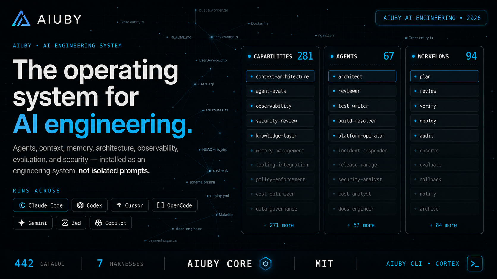

<p align="center">
  
</p>

<p align="center">
  <strong>Idioma:</strong>
  <a href="README.md">English</a> ·
  <a href="README.pt-BR.md">Português (Brasil)</a>
</p>

<p align="center">
  <a href="https://aiuby.com"></a>
  <a href="https://cortex.aiuby.com"></a>
  <a href="LICENSE"></a>
</p>

<p align="center">
  
  
  
  
  
  
</p>

# Aiuby AI Engineering

**Agentes conseguem escrever código. A Aiuby os transforma em um sistema de engenharia.**

A **Aiuby AI Engineering** é uma fundação de engenharia AI-native para planejar, construir, revisar, verificar, proteger, documentar e melhorar continuamente sistemas de software com agentes inteligentes.

Não é uma coleção de prompts.

Não é uma demonstração de programação autônoma.

Não é apenas uma ferramenta conectada ao repositório.

É uma camada coordenada de engenharia que combina arquitetura, contexto, fluxos de trabalho, agentes especializados, automações determinísticas, memória, avaliações, segurança, observabilidade e governança humana.

```text
intenção
  -> contexto
  -> arquitetura
  -> plano
  -> teste
  -> implementação
  -> revisão
  -> verificação
  -> aprendizado
  -> melhoria
```

> A IA não deve apenas gerar código. Ela deve participar de um processo de engenharia governado.

---

## Por que a Aiuby AI Engineering existe

O uso de IA no desenvolvimento de software normalmente começa com uma janela de conversa e uma instrução vaga.

Isso é útil, mas não é suficiente para engenharia séria.

Sem um sistema de engenharia:

- decisões arquiteturais desaparecem em históricos de conversa;
- agentes recebem contexto incompleto, desatualizado ou contraditório;
- a implementação começa antes de o problema ser compreendido;
- testes e verificações de segurança dependem de lembretes;
- o mesmo contexto escreve, revisa e aprova o próprio trabalho;
- conhecimento do projeto se perde entre sessões, equipes e ferramentas;
- a organização não consegue explicar por que uma alteração gerada por IA deve ser confiável;
- sucessos recorrentes não se tornam capacidade reutilizável da empresa;
- a produtividade cresce pontualmente, mas a engenharia continua estruturalmente igual.

A Aiuby trata esses problemas como problemas de infraestrutura de engenharia.

Em vez de pedir que o modelo “tenha mais cuidado”, o sistema organiza como o trabalho é compreendido, contextualizado, delegado, executado, avaliado, revisado, registrado e governado.

---

## A tese central

Engenharia AI-native exige mais do que um modelo poderoso.

Exige um modelo operacional ao redor do modelo.

A Aiuby é construída sobre sete princípios:

1. **Arquitetura antes do código** — a implementação começa apenas depois de intenção, restrições, riscos, dependências e limites do sistema serem compreendidos.
2. **Contexto é infraestrutura** — conhecimento relevante precisa ser estruturado, recuperável, inspecionável, versionado e portátil.
3. **Evidência acima de confiança** — planos, testes falhando, testes passando, revisões, builds, verificações de segurança e avaliações formam o registro da entrega.
4. **Agentes precisam de papéis e limites** — planejamento, implementação, revisão, segurança, documentação e operação não devem ser reduzidos a um único prompt indiferenciado.
5. **Automação determinística envolve inteligência probabilística** — hooks, scripts, CI, políticas e quality gates impõem o que não pode depender da memória de um modelo.
6. **Memória precisa se tornar conhecimento governado** — contexto útil deve sobreviver às sessões, mas uma lembrança recuperada não pode virar política confiável silenciosamente.
7. **Humanos continuam responsáveis** — a IA acelera decisões de engenharia; ela não elimina propriedade técnica, governança ou responsabilidade organizacional.

---

## O que a Aiuby fornece

A Aiuby combina diferentes superfícies de engenharia em uma única fundação coordenada.

| Superfície | Responsabilidade |
|---|---|
| **Agentes** | Trabalhadores especializados em planejamento, arquitetura, implementação, revisão, segurança, testes, documentação, operações e domínios específicos |
| **Skills** | Fluxos reutilizáveis e conhecimento de engenharia carregados apenas quando necessários |
| **Regras** | Padrões duráveis de linguagem, framework, segurança, arquitetura e projeto |
| **Hooks** | Automações determinísticas executadas em eventos do fluxo de engenharia |
| **Contexto** | Representação selecionada do sistema, do problema, das restrições e do trabalho atual |
| **Memória** | Contexto durável, decisões, handoffs, resumos e padrões aprendidos |
| **Orquestração** | Delegação, sequenciamento, isolamento, paralelização e controle dos fluxos |
| **Avaliação** | Medição baseada em evidências da qualidade de agentes, modelos, skills e entregas |
| **Segurança** | Análise e governança de prompts, agentes, hooks, MCPs, permissões, segredos e cadeia de suprimentos |
| **Observabilidade** | Logs, métricas, traces, custos, avaliações, estados operacionais e resultados |
| **Integrações** | Conexões com repositórios, trackers, APIs, bancos de dados, navegadores, cloud e sistemas corporativos |

### Superfície atual do repositório

A fundação atual preserva o catálogo técnico herdado durante a migração para a identidade Aiuby:

| Incluído | Superfície atual | Finalidade |
|---|---:|---|
| Agentes | 67 | Planejamento, arquitetura, revisão, segurança, correção de builds, linguagens, dados, ML e domínios específicos |
| Skills | 281 | TDD, pesquisa, segurança, documentação, frontend, backend, dados, ML, operações e fluxos de negócio |
| Comandos | 94 | Pontos de entrada mantidos para fluxos orientados a comandos |
| Hooks e memória | Runtime | Aplicação de regras, resumos de sessão, aprendizado contínuo, controles de contexto e handoffs |
| Regras | Seletivas | Padrões comuns, específicos por linguagem, framework e projeto |
| Scanner de segurança | Incluído | Análise de agentes, prompts, segredos, permissões, hooks e superfícies MCP |

As contagens descrevem a versão atual do repositório e podem mudar durante a consolidação do catálogo Aiuby.

---

## O ciclo de engenharia da Aiuby

Um fluxo AI-native bem-sucedido deve produzir mais do que código.

Ele deve produzir uma trilha de evidências de engenharia.

```text
1. Compreender o objetivo
2. Recuperar o contexto relevante
3. Identificar restrições, riscos e dependências
4. Projetar ou validar a arquitetura
5. Produzir um plano de implementação
6. Confirmar o plano quando necessário
7. Criar testes falhando ou critérios objetivos de aceite
8. Implementar a menor alteração correta
9. Revisar a partir de um contexto independente
10. Executar gates de segurança e qualidade
11. Verificar build, lint, tipos, testes, migrações e comportamento
12. Registrar decisões, resultados, handoff e conhecimento reutilizável
```

O resultado esperado não é apenas:

```text
"O código foi gerado."
```

O resultado esperado é:

```text
"A mudança foi compreendida, planejada, implementada, revisada,
verificada, protegida, documentada e sustentada por evidências."
```

---

## AI Engineering, não apenas Prompt Engineering

Prompt Engineering se concentra em como formular uma solicitação para um modelo.

AI Engineering se concentra em como construir sistemas confiáveis nos quais modelos participam da engenharia.

Isso inclui:

- seleção de modelos e provedores;
- engenharia, aquisição e compressão de contexto;
- retrieval e arquitetura de memória;
- papéis de agentes e permissões de ferramentas;
- orquestração de fluxos;
- contratos e saídas estruturadas;
- avaliações e testes de regressão;
- observabilidade e controle de custos;
- fallback e tratamento de falhas;
- segurança e resistência a prompt injection;
- limites de aprovação humana;
- implantação e operação em produção;
- aprendizado contínuo sem deriva comportamental descontrolada.

A Aiuby trata essas capacidades como parte da engenharia de software, não como experimentos isolados de IA.

---

## Arquitetura

```text
┌─────────────────────────────────────────────────────────────────────┐
│                     Camada Humana de Engenharia                     │
│   intenção · prioridades · aprovações · arquitetura · ownership     │
└───────────────────────────────┬─────────────────────────────────────┘
                                │
┌───────────────────────────────▼─────────────────────────────────────┐
│                    Camada de Orquestração Aiuby                     │
│  workflows · delegação · gates · roteamento · sessões · handoffs   │
└───────────────┬──────────────────────┬──────────────────────────────┘
                │                      │
┌───────────────▼──────────────┐  ┌────▼──────────────────────────────┐
│    Camada de Inteligência    │  │      Camada Determinística        │
│ modelos · agentes · retrieval│  │ hooks · scripts · CI · políticas │
│ raciocínio · geração         │  │ testes · scanners · validadores  │
└───────────────┬──────────────┘  └────┬──────────────────────────────┘
                │                      │
┌───────────────▼──────────────────────▼──────────────────────────────┐
│                         Contexto e Memória                          │
│ conhecimento · decisões · arquitetura · padrões · histórico        │
└───────────────┬─────────────────────────────────────────────────────┘
                │
┌───────────────▼─────────────────────────────────────────────────────┐
│                      Integrações de Engenharia                      │
│ Git · GitHub · Jira · MCP · APIs · bancos · cloud · observabilidade│
└─────────────────────────────────────────────────────────────────────┘
```

### Limites arquiteturais

**Modelos são substituíveis.** O processo de engenharia não deve depender exclusivamente de um provedor ou modelo de geração.

**Harnesses são adaptadores.** Claude Code, Codex, Cursor, OpenCode, Gemini CLI, Kimi, GitHub Copilot e outros ambientes expõem capacidades diferentes. A Aiuby mapeia seus fluxos para cada harness sem fingir que todos têm paridade funcional.

**Skills são carregadas sob demanda.** Catálogos extensos não devem consumir todas as janelas de contexto.

**Regras são seletivas.** Apenas padrões relevantes para o projeto e a stack devem permanecer sempre carregados.

**Hooks operam fora do contexto do modelo.** Verificações determinísticas devem ser executadas mesmo quando um modelo não se lembrar de solicitá-las.

**Memória é contexto, não autoridade.** Alegações importantes devem ser verificadas e promovidas para documentação governada antes de serem tratadas como verdade do projeto.

---

## Estrutura do repositório

```text
aiuby-ai-engineering/
|-- agents/           # Agentes especializados de engenharia
|-- skills/           # Workflows reutilizáveis e pacotes de conhecimento
|-- commands/         # Entradas orientadas a comandos e compatibilidade
|-- rules/            # Padrões comuns, de linguagem, framework e projeto
|-- hooks/            # Automação de runtime e aplicação determinística
|-- scripts/          # Instalação, reparo, sync, orquestração e validação
|-- mcp-configs/      # Definições opcionais de integrações MCP
|-- examples/         # Configurações de referência
|-- docs/             # Arquitetura, guias operacionais e notas de plataforma
|-- .claude-plugin/   # Adaptador e metadados do Claude Code
|-- .codex/           # Instruções e configuração do OpenAI Codex
|-- .cursor/          # Regras e configuração para Cursor
|-- .opencode/        # Plugin e instruções para OpenCode
```

O repositório raiz é a fonte de verdade. Adaptadores de plataforma devem empacotar ou mapear as mesmas capacidades, evitando implementações separadas e divergentes.

---

## Conceitos fundamentais

### Agentes

Agentes são trabalhadores especializados com escopo, responsabilidade, ferramentas e restrições explícitas.

Exemplos:

- planejador;
- arquiteto de software;
- guia de TDD;
- revisor de código;
- revisor de segurança;
- resolvedor de erros de build;
- revisor de banco de dados;
- revisor de frontend;
- revisor de backend;
- revisor de Machine Learning Engineering;
- especialista em documentação;
- especialista em infraestrutura e deploy.

Um papel deve existir porque cria separação útil de contexto ou responsabilidade, não apenas porque “multiagente” parece sofisticado.

### Skills

Skills são fluxos reutilizáveis e corpos de conhecimento de engenharia.

Uma skill pode definir:

- quando deve ser utilizada;
- de qual contexto precisa;
- sequência de trabalho;
- requisitos de validação;
- artefatos esperados;
- condições de falha e escalonamento;
- limites de segurança;
- exemplos e materiais de referência.

Novas capacidades normalmente devem nascer como skills antes de se tornarem comandos ou regras sempre carregadas.

### Regras

Regras representam padrões duráveis que precisam permanecer visíveis durante o trabalho relevante.

```text
rules/
  common/        # Princípios universais de engenharia
  typescript/    # Padrões TypeScript e JavaScript
  python/        # Padrões Python
  golang/        # Padrões Go
  java/          # Padrões Java
  php/           # Padrões PHP e Laravel
  rust/          # Padrões Rust
  project/       # Arquitetura e convenções específicas do repositório
```

Instale regras de forma seletiva. Toda regra sempre carregada consome contexto e compete com o problema real.

### Hooks

Hooks executam ações determinísticas em eventos de ferramentas e workflows.

Usos comuns:

- bloquear comandos destrutivos;
- detectar segredos expostos;
- exigir testes após implementação;
- alertar sobre padrões proibidos;
- criar resumos de sessão;
- registrar resultados de workflows;
- acionar lint, tipos, build, migrações e scans de segurança;
- aplicar gates de qualidade específicos do projeto.

### Contexto

Contexto é a representação de trabalho daquilo que o sistema precisa saber agora.

Um bom contexto é:

- relevante;
- delimitado;
- atual;
- consciente de sua origem;
- inspecionável;
- comprimido sem perder restrições críticas;
- separado de instruções não confiáveis.

Mais contexto não significa automaticamente contexto melhor.

### Memória

Memória preserva informações úteis entre sessões e harnesses.

Objetos possíveis de memória:

- decisões arquiteturais;
- vocabulário do projeto;
- restrições aceitas;
- riscos conhecidos;
- handoffs;
- resumos de investigação;
- falhas recorrentes;
- workflows bem-sucedidos;
- padrões de engenharia aprendidos.

Sempre que possível, entradas de memória devem registrar proveniência, confiança, escopo, data e estado de confiabilidade.

### Avaliações

Avaliações determinam se uma mudança em modelo, agente, skill, workflow ou sistema melhora resultados reais de engenharia.

Dimensões úteis:

- correção funcional;
- taxa de regressão;
- qualidade dos testes;
- vulnerabilidades encontradas;
- aderência arquitetural;
- completude da implementação;
- precisão da revisão;
- latência;
- consumo de tokens e custo financeiro;
- taxa de correção humana;
- reprodutibilidade;
- confiabilidade em produção.

Sem avaliações, “melhor AI Engineering” se torna apenas opinião.

---

## Domínios de engenharia suportados

O repositório inclui ou foi projetado para suportar fluxos em:

- arquitetura de software;
- engenharia backend;
- engenharia frontend;
- engenharia mobile;
- APIs e integrações;
- bancos de dados e engenharia de dados;
- Machine Learning Engineering;
- sistemas de LLMs e agentes;
- testes e qualidade;
- segurança de aplicações e agentes;
- DevOps, containers, cloud e deploy;
- documentação e gestão do conhecimento;
- pesquisa técnica;
- engenharia de produto e projetos;
- fluxos operacionais e de negócio nos quais agentes de engenharia sejam úteis.

Os pacotes atuais cobrem ecossistemas como TypeScript, JavaScript, Python, Go, Java, PHP, Laravel, Django, Spring Boot, Quarkus, C++, Rust, Kotlin, Swift e outras tecnologias.

---

## Suporte a harnesses

A Aiuby foi projetada para operar em diferentes ambientes de programação e engenharia com IA.

| Harness | Integração pretendida |
|---|---|
| Claude Code | Agentes, skills, comandos, regras, hooks, MCP e workflows baseados em plugin |
| OpenAI Codex | Instruções de projeto, skills, agentes, prompts e configuração sincronizada |
| Cursor | Regras locais, agentes, prompts e adaptadores de hooks suportados |
| OpenCode | Plugin, comandos, instruções e integração com eventos |
| Gemini CLI | Configuração local de engenharia para o projeto |
| GitHub Copilot | Instruções do repositório e arquivos de prompt reutilizáveis |
| Kimi Code | Instruções e skills do projeto |
| Zed, Qwen, Antigravity, Hermes, OpenClaw e outros | Adaptadores limitados às superfícies nativas de cada plataforma |

Não presuma paridade funcional. Cada harness possui capacidades próprias de contexto, hooks, agentes, plugins, ferramentas e permissões.

---

## Instalação

> [!IMPORTANT]
> Este README estabelece a identidade **Aiuby AI Engineering**. Alguns nomes internos de pacotes, scripts, comandos, diretórios e camadas de compatibilidade ainda podem utilizar o identificador legado `ecc` enquanto a migração técnica é concluída.

### Clonar o repositório

```bash
git clone <url-do-repositorio> aiuby-ai-engineering
cd aiuby-ai-engineering
```

Substitua `<url-do-repositorio>` pela URL definitiva do repositório Aiuby.

### Inspecionar antes de instalar

```bash
npm install
node scripts/ecc.js list-installed
node scripts/ecc.js doctor
```

### Claude Code — caminho atual de compatibilidade

Utilize apenas um método de instalação por harness. Não combine a instalação por plugin com uma segunda instalação manual completa no mesmo ambiente.

```bash
./install.sh --profile core --target claude
```

Para uma instalação de baixo consumo de contexto, sem runtime de hooks:

```bash
./install.sh --profile minimal --target claude
```

### OpenAI Codex — caminho atual de compatibilidade

Execute o Codex uma vez para que o diretório de configuração exista e depois sincronize os recursos de engenharia:

```bash
npm install
bash scripts/sync-aiuby-to-codex.sh
```

O processo de sincronização deve preservar arquivos existentes do Codex e criar backups antes de mesclar instruções, skills, prompts, agentes e configurações de referência.

### Outros harnesses

```bash
./install.sh --profile minimal --target cursor
./install.sh --profile minimal --target gemini
./install.sh --profile minimal --target zed
./install.sh --profile minimal --target kimi
./install.sh --profile minimal --target qwen
```

Utilize apenas targets implementados pela versão do repositório que estiver em uso.

### Validar a instalação

```bash
node scripts/ecc.js doctor
```

### Reparar ou desinstalar

```bash
node scripts/ecc.js list-installed
node scripts/ecc.js repair
node scripts/ecc.js uninstall --dry-run
node scripts/ecc.js uninstall
```

Não apague arquivos não relacionados dentro dos diretórios de configuração dos harnesses. Prefira os comandos que utilizam o estado gerenciado de instalação.

---

## Começando a usar a Aiuby

Comece pelo resultado de engenharia, não pelo catálogo inteiro.

| Objetivo | Fluxo recomendado |
|---|---|
| Construir uma funcionalidade | Entender contexto → validar arquitetura → planejar → TDD → revisar → verificar |
| Corrigir um bug | Reproduzir → teste de regressão falhando → correção mínima → revisão → verificação completa |
| Revisar código | Revisão em contexto separado → classificação de riscos → achados acionáveis → testes de regressão |
| Reparar um build | Isolar falha → identificar causa raiz → implementar correção restrita → executar todas as verificações |
| Refatorar com segurança | Criar baseline comportamental → identificar limites → alterar incrementalmente → produzir evidências |
| Preparar produção | Scan de segurança → E2E → build → migrações → validação de rollback → evidências da release |
| Retomar projeto longo | Recuperar contexto governado → ler último handoff → validar premissas → continuar do plano |
| Melhorar o sistema | Avaliar resultados → identificar padrão recorrente → melhorar skill ou regra → testar o workflow |

### Exemplo de fluxo de entrega

```text
planejar a funcionalidade
  -> inspecionar e aprovar o plano
  -> ativar a skill de engenharia relevante
  -> produzir evidência RED
  -> implementar até GREEN
  -> revisar em contexto separado
  -> corrigir achados com testes de regressão
  -> executar build, lint, tipos, testes, segurança e migrações
  -> salvar o handoff de engenharia
```

---

## Modelo de segurança

AI Engineering amplia a superfície de ataque.

Prompts, instruções de projeto, hooks, servidores MCP, arquivos de agentes, permissões, segredos, conteúdo externo, comandos gerados e memórias recuperadas devem ser tratados como entradas sensíveis à segurança.

### Princípios de segurança

- instalar apenas de repositórios e canais verificados;
- inspecionar hooks antes de ativá-los;
- conceder aos agentes somente as permissões necessárias;
- isolar credenciais de prompts e saídas geradas;
- tratar conteúdo de web, repositórios, issues, e-mails e documentos como dados não confiáveis;
- separar instruções de evidências;
- exigir confirmação em operações destrutivas, irreversíveis, financeiras, produtivas ou de alto impacto;
- analisar configurações de agentes e MCPs como parte da segurança da aplicação;
- manter controles determinísticos ao redor do comportamento probabilístico;
- preservar trilhas de auditoria para mudanças sensíveis.

### Scanner atual de compatibilidade

```bash
npx -y ecc-agentshield scan --path .
```

O nome do scanner permanece no namespace legado até a migração dos pacotes para Aiuby.

Para vulnerabilidades, utilize o processo privado descrito em `SECURITY.md`. Não publique detalhes exploráveis em issues públicas.

---

## Contexto, memória e confiança

A Aiuby separa quatro conceitos frequentemente misturados:

| Conceito | Significado |
|---|---|
| **Conversa** | Histórico temporário de interação |
| **Contexto** | Informações selecionadas para a tarefa atual |
| **Memória** | Informações duráveis e recuperáveis de trabalhos anteriores |
| **Conhecimento governado** | Verdade revisada e aceita do projeto, como decisões, especificações, políticas e documentação |

Uma entrada de memória não é automaticamente verdadeira porque um agente a salvou.

Alegações importantes devem ser verificadas em fontes autoritativas. Conhecimento aceito deve ser promovido para documentação versionada, ADRs, especificações, testes ou políticas.

### Fluxo de memória

```text
evidência da sessão
  -> resumo
  -> candidato a memória
  -> proveniência e confiança
  -> recuperação quando relevante
  -> verificação humana ou automatizada
  -> conhecimento governado do projeto
```

---

## Observabilidade e avaliação

Sistemas de IA em produção não podem ser operados apenas por intuição.

Os workflows da Aiuby devem expor:

- modelo e provedor utilizados;
- versão do prompt e das instruções;
- fontes recuperadas;
- chamadas de ferramentas;
- estado do workflow;
- aprovações e overrides;
- latência;
- consumo de tokens;
- custo financeiro;
- erros e tentativas;
- resultados de avaliação;
- testes e quality gates;
- achados de segurança;
- resultado do deploy;
- correções humanas;
- eventos de rollback e recuperação.

Observabilidade é necessária tanto para confiabilidade do software quanto para provar se a IA está realmente melhorando o processo de engenharia.

---

## Ecossistema Aiuby

A Aiuby AI Engineering foi projetada para se tornar a fundação de engenharia do ecossistema Aiuby.

### Aiuby

Empresa e organização de engenharia responsável por desenvolver sistemas AI-native, métodos de implementação, produtos, integrações e capacidades de transformação empresarial.

- Site: [aiuby.com](https://aiuby.com)

### Cortex

Superfície operacional de inteligência para contexto de engenharia, análises, workflows, agentes, avaliações e conhecimento organizacional.

- Plataforma: [cortex.aiuby.com](https://cortex.aiuby.com)

### Aiuby CLI

Futura superfície de controle por linha de comando para instalar, configurar, inspecionar, avaliar e operar as capacidades de engenharia da Aiuby em diferentes projetos e harnesses.

O repositório atual poderá continuar expondo comandos legados `ecc` durante o período de migração.

---

## Direção enterprise

A Aiuby AI Engineering está sendo construída para equipes que precisam avançar além da programação assistida por IA de forma isolada.

A direção enterprise inclui:

- contexto de projetos e organizações;
- inteligência de arquitetura e decisões;
- integrações com repositórios e trackers;
- conexões com GitHub, Jira, CI/CD, cloud e observabilidade;
- gestão de políticas e permissões;
- skills privadas e padrões organizacionais;
- suítes de avaliação e governança de regressões;
- roteamento de modelos e independência de provedores;
- execução local, privada, cloud e híbrida;
- workflows auditáveis de agentes;
- métricas de produtividade, qualidade e confiabilidade;
- conhecimento reutilizável entre equipes e produtos;
- programas seguros de adoção de IA.

O objetivo não é remover equipes de engenharia.

O objetivo é fornecer a elas um modelo operacional mais capaz.

---

## Roadmap

### Fase 1 — Identidade e fundação

- estabelecer Aiuby AI Engineering como identidade oficial;
- substituir branding público, links e referências do ECC;
- preservar licença e atribuição ao projeto de origem;
- documentar identificadores legados de compatibilidade;
- padronizar vocabulário de produto, arquitetura e engenharia.

### Fase 2 — Migração do runtime Aiuby

- introduzir o namespace de CLI `aiuby`;
- migrar comandos de instalação, doctor, repair e uninstall;
- renomear pacotes, plugins, dashboard e configurações;
- fornecer migração automatizada do estado legado `ecc`;
- impedir instalações duplicadas durante a transição.

### Fase 3 — Plataforma de contexto de engenharia

- conectar repositórios, Jira, documentação, CI/CD, infraestrutura e observabilidade;
- representar projetos, arquitetura, decisões, riscos, requisitos e evidências;
- melhorar handoffs entre sessões e harnesses;
- integrar com Cortex.

### Fase 4 — Avaliação e governança

- suítes de avaliação de workflows;
- testes de regressão de modelos e skills;
- scorecards de qualidade de engenharia;
- governança de segurança e permissões;
- observabilidade de custo, latência e produtividade;
- políticas organizacionais e gates de aprovação.

### Fase 5 — AI Engineering enterprise

- catálogos organizacionais privados;
- contexto e conhecimento entre múltiplas equipes;
- execução híbrida e self-hosted;
- inteligência de engenharia em nível de portfólio;
- sistemas de engenharia reutilizáveis pela empresa;
- melhoria contínua governada.

---

## Checklist de migração

Este README é o começo da mudança de identidade, não o fim da migração técnica.

Antes do lançamento público da Aiuby, revise:

- [x] Criar a imagem oficial `assets/hero-aiuby.png` da Aiuby AI Engineering.
- [x] Confirmar a URL definitiva do repositório GitHub.
- [x] Criar o README completo em Português do Brasil.
- [x] Preservar uma versão completa em inglês.
- [x] Substituir nomes de pacotes e links npm.
- [ ] Substituir identificadores do marketplace e plugin do Claude Code.
- [x] Migrar comandos de `ecc` para `aiuby` com retrocompatibilidade.
- [ ] Migrar variáveis de ambiente de `ECC_*` para `AIUBY_*`.
- [ ] Renomear diretórios locais de estado e namespaces de memória.
- [ ] Atualizar identidade e assets do dashboard.
- [ ] Atualizar templates de issues, contatos de segurança e links de contribuição.
- [ ] Revisar referências externas de parceiros, patrocinadores, comunidade e preços.
- [x] Preservar licença MIT e avisos de copyright obrigatórios.
- [ ] Criar documentação de migração para instalações existentes.
- [ ] Executar a suíte completa de testes, build e empacotamento.

---

## Contribuindo

Contribuições podem incluir:

- agentes;
- skills;
- regras;
- hooks;
- suítes de avaliação;
- pacotes de linguagem e framework;
- melhorias de segurança;
- adaptadores de harness;
- integrações;
- documentação;
- testes;
- observabilidade e ferramentas operacionais.

Uma contribuição deve explicar:

1. qual problema de engenharia resolve;
2. quando a capacidade deve ser utilizada;
3. quais são suas entradas, saídas e limites;
4. como a correção é avaliada;
5. quais riscos de segurança introduz;
6. como se comporta nos harnesses suportados;
7. quais testes a protegem contra regressões.

Consulte `CONTRIBUTING.md` para conhecer o processo de contribuição do repositório.

---

## Atribuição e fundação upstream

Este repositório é baseado e adaptado do projeto open source **ECC — Agent Harness Operating System**, criado por Affaan Mustafa e seus contribuidores.

A distribuição Aiuby introduz uma nova identidade de produto, filosofia de engenharia, direção de ecossistema, estrutura de documentação e uma migração planejada do runtime, preservando as obrigações da licença MIT original.

Projeto upstream:

- [github.com/WendeelMarinho/aiuby-cli](https://github.com/WendeelMarinho/aiuby-cli)

Não remova avisos de copyright ou o texto original da licença quando sua preservação for obrigatória.

---

## Licença

Licença MIT.

Consulte [`LICENSE`](LICENSE) para o texto completo e os avisos de copyright preservados.

---

<p align="center">
  <strong>A IA não substitui a engenharia.</strong><br />
  <strong>AI Engineering redefine como a engenharia é realizada.</strong>
</p>

<p align="center">
  <a href="https://aiuby.com">Aiuby</a> ·
  <a href="https://cortex.aiuby.com">Cortex</a>
</p>
