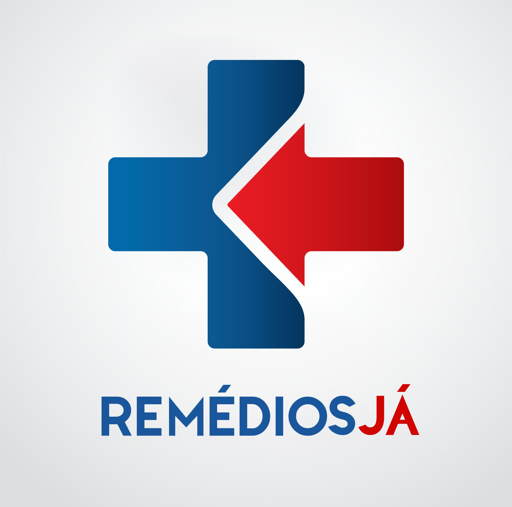
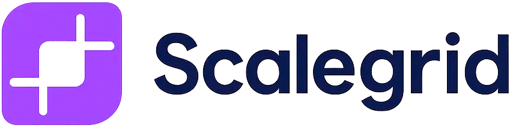

# Sponsors

Aiuby AI Engineering is open source under MIT. Sponsorship funds maintenance,
security review, and release work.

**[Become a sponsor →](https://github.com/sponsors/WendeelMarinho)**

## Current sponsors

  <table>
    <tr>
      <td align="center" width="50%">
         
        <strong>RemédiosJÁ</strong>
      </td>
      <td align="center" width="50%">
         
        <strong>Scalegrid</strong>
      </td>
    </tr>
  </table>

<!-- Links pending: add each sponsor's canonical URL when confirmed. Not guessed. -->

## Tiers

Tiers, amounts, and benefits are defined on
[GitHub Sponsors](https://github.com/sponsors/WendeelMarinho), which is the
single source of truth. They are deliberately not duplicated here — a copy in
the repository drifts from the real offer, and a stale price is worse than no
price.

Sponsorship buys visibility and supports the work. It does not bundle seats,
an SLA, custom development, support commitments, or preferential technical
placement unless separately agreed in writing.

## Corporate sponsorship

For corporate sponsorship, partnerships, or integration discussions, email
**[wendeelmarinho@gmail.com](mailto:wendeelmarinho@gmail.com)** with your
company name and what you have in mind.

---

Sponsors of the upstream [ECC](https://github.com/affaan-m/ECC) project are
not listed here. They supported that project, not this one — see
[UPSTREAM.md](UPSTREAM.md).
